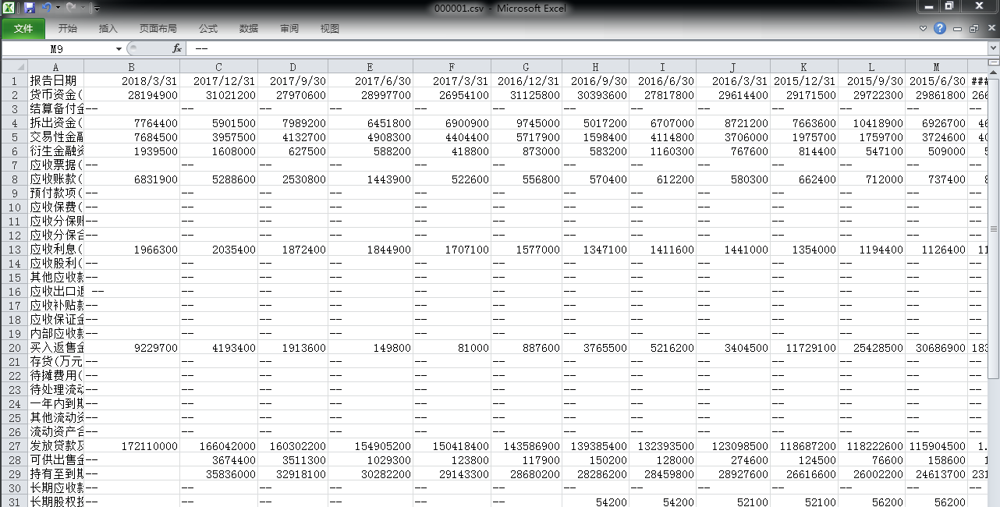
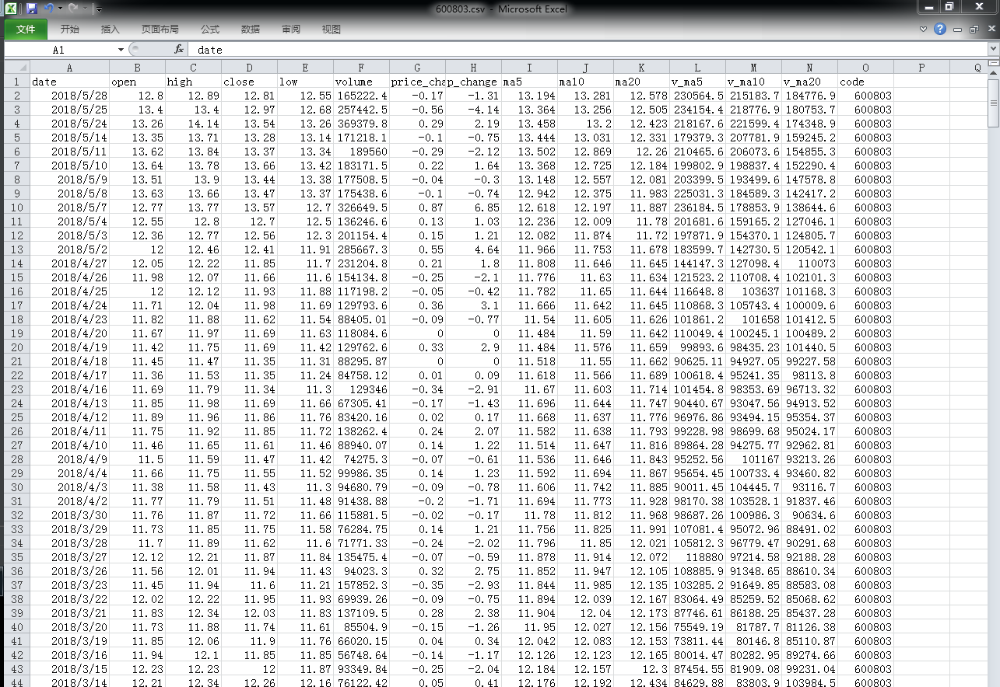
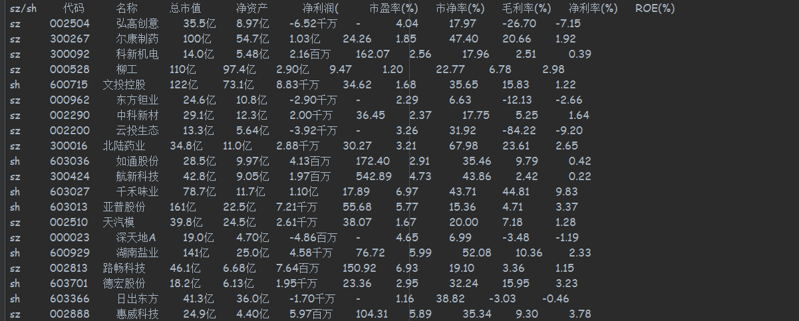
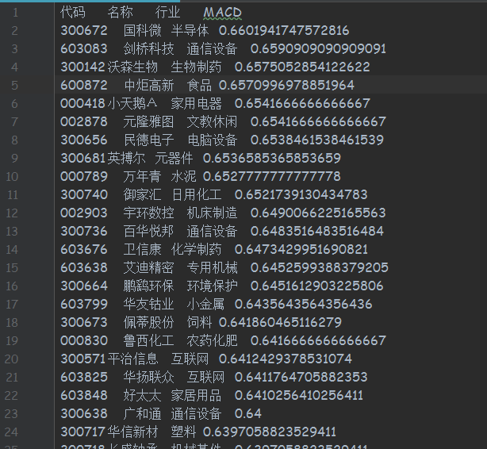
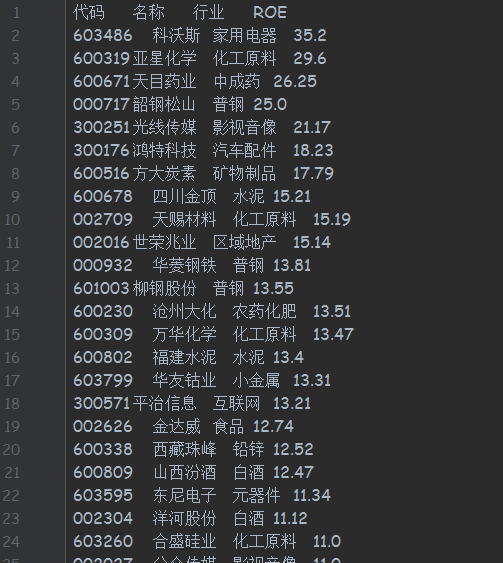
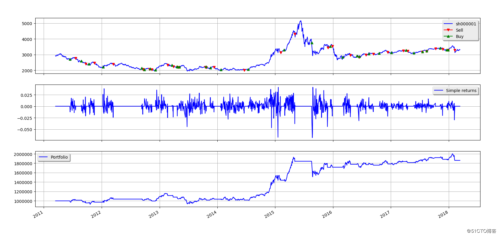
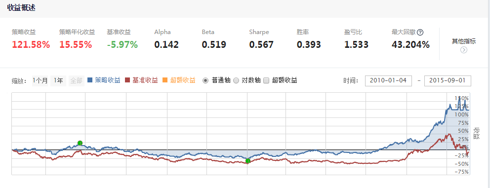
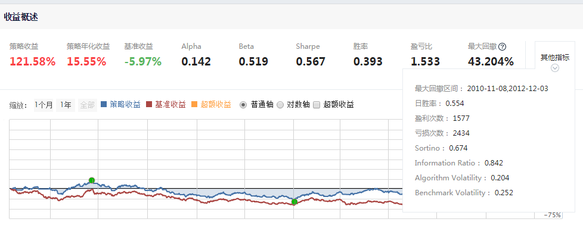

# StockAnalysis Based On Dual Thrust Strategy
This project is to analyse the 3520 stocks of A shares.

> Environment: python 3.5.3

## 1. Install Required third-party Package
```commandline
    pip3 install tushare //财经数据接口
    pip3 install requests //简单爬虫
    pip3 install BeautifulSoup //html页面解析
    pip3 install multiprocessing //单核多线程处理一些流程
    pip3 install matplotlib  //画图分析
    pip3 install pandas  //数据统计与处理
    pip3 install stockstats  //通过股价源数据生成17种股价指标
    pip3 install pyalgotrade    //策略分析接口python2.7版本
    pip3 install pyalgotrade-python3    //策略分析接口python3版本
    pip3 install slippage   //pyalgotrade依赖的库
    pip3 install DataAPI   //暂时没有用到  今后做数据的精准评测可以用
```

## 2. Generate Data of stocks
- 股票代码，名称及所属行业（来源：tushare）
- 每支股票的三大财报数据（来源：网易财经个股财务报表）
- 每支股票近七年股价数据【供策略分析】（来源：tushare）
- 每支股票近三年的股价历史数据（来源：tushare）
- 每支股票的财务统计数据（来源：东方财富网个股页面）

```commandline
python3 preprocess.py
```
## 3. Data Structure Demo：
> 财务报表数据格式图示：



> 股价数据数据格式图示：



> 财务统计数据格式图示：



## 4.Sort Stocks

```commandline
python3 process.py
```

- MACD排序



- ROE排序



## 5.DualThrust Strategy Analyze And backtest

```commandline
python3 DualTrustStrategy.py
```

> 通过PyAlgo官网教程提供的API进行Dual Thrust策略的实现并进行回测（backtest）

> 输入：第四步筛选出来的股票代码以及他们近7年的股价数据

> 输出：通过Dual Thrust策略进行回测得出每支股票的回测指标（包括夏普率、累计收益率、最大回撤比例、最长回撤周期、最终收益、交易次数占比等等）

回测结果如下图所示：




## 6.聚宽(JointQuant)平台回测

### Dual Thrust策略回测代码（以600230为例）如下：


```commandline
def initialize(context):
    g.security = get_index_stocks('000905.XSHG')
    set_universe(g.security)
    set_benchmark('600230.XSHG')
    set_commission(PerTrade(buy_cost=0.0003, sell_cost=0.0013, min_cost=5))
    
    
def handle_data(context, data):
    stocknum = 50
    security = g.security
    # 根据大盘指数进行止损
    his = attribute_history('600230.XSHG', 10, '1d', 'close')
    if ((1-float(his['close'][-1]/his['close'][0]))>=0.03):
        if len(context.portfolio.positions)>0:
            for stock in list(context.portfolio.positions.keys()):
                order_target(stock, 0)
        return
    # 分配资金
    if len(context.portfolio.positions) < stocknum:
        Num = stocknum - len(context.portfolio.positions)
        Cash = context.portfolio.cash/Num
    else:
        Cash = context.portfolio.cash
    # Buy
    for stock in security:
        # 求出持有该股票的仓位，买入没有持仓并符合条件股票
        position = context.portfolio.positions[stock].amount
        if position < 100:
            hist = attribute_history(stock, 3, '1d', ('high','low','close','open'))
            HH = max(hist['high'][:-1])
            LC = min(hist['close'][:-1])
            HC = max(hist['close'][:-1])
            LL = min(hist['low'][:-1])
            Open = hist['open'][-1]
            # 使用第n-1日的收盘价作为当前价
            current_price = hist['close'][-1]
            Range = max((HH-LC),(HC-LL))
            K1 = 0.9
            BuyLine = Open + K1 * Range
            if current_price>BuyLine:# and position < 100:
                order_value(stock, Cash)
    # Sell
    for stock in list(context.portfolio.positions.keys()):
        hist = history(3, '1d', 'close', [stock])
        case1 = (1-(hist[stock][-1]/hist[stock][0]))>=0.06
        case2 = (1-(hist[stock][-2]/hist[stock][0]))>=0.08
        if case1 or case2:
            order_target(stock, 0)

```

> 回测详情：





